# ➕ the-Greatest-Calculator : 최고의 계산기사 ➗

### <a href="http://ewhaqup.com"> 스토리형 수학 게임 앱 </a> (추후 링크 연결하기)

<b> 헉! 여기다 오글거리는 스토리를 적을 계획인가봐!</b>
  
세계관이야기...
 
줄줄

 
🏆 제 2회 웅진 싱크빅 게임 개발 챌린지 수상작  

  

## ➗ 개발자

### team C.crew

<table style="width: 100%;"> 
  <tr>
    <tr>
    <th>정은채 
    <a href="https://github.com/Goldchae" target="_blank">(Goldchae)</a>
    </th>
  </tr>
  </tr>
  <tr>
    <td>Leader , unity(FE) / DB(firebase)</td>
  </tr>
</table>

<table style="width: 100%;">
  <tr>
    <tr>
    <th>윤수연
    <a href="https://github.com/iioese" target="_blank">(iioese)</a>
    </th>
  </tr>
  </tr>
  <tr>
    <td>unity(FE)</td>
  </tr>
</table>

<table style="width: 100%;">
  <tr>
    <tr>
    <th>이다윤 
    <a href="https://github.com/" target="_blank">()</a>
    </th>
  </tr>
  </tr>
  <tr>
    <td> Designer</td>
  </tr>
</table>

<table style="width: 100%;">
  <tr>
    <tr>
    <th>000 
    <a href="https://github.com/" target="_blank">()</a>
    </th>
  </tr>
  </tr>
  <tr>
    <td>00</td>
  </tr>
</table>

<table style="width: 100%;">
  <tr>
    <tr>
    <th>000 
    <a href="https://github.com/" target="_blank">()</a>
    </th>
  </tr>
  </tr>
  <tr>
    <td>00</td>
  </tr>
</table>

### 도움

<table style="width: 100%;">
  <tr>
    <tr>
    <th>이지언 
    <a href="https://github.com/e-z-code" target="_blank">(e-z-code)</a>
    </th>
  </tr>
  </tr>
  <tr>
    <td>Reverse Engineer</td>
  </tr>
</table>
<table style="width: 100%;">
  <tr>
    <tr>
    <th>펭귄
    <a href="https://github.com/arduinocc04" target="_blank">(arduinocc04)</a>
    </th>
  </tr>
  </tr>
  <tr>
    <td>스파게티 비비기, 도망치기</td>
  </tr>
</table>

 

## ➗ 기술 스택

Unity 6

- 안드로이드 앱 / ios 앱 빌드

Firebase

- Realtime DB 서비스 이용

 

## ➗ 릴리즈 노트

<table style="width: 100%;  border: 3px solid Blue;  ">
  <tr>
    <td>
      <h3>v1.0.0 (2025-1-)</h3>
      <ul>
        <li><strong>스테이지</strong>: 튜토리얼 버튼 되찾기 스테이지</li>
        <li><strong>랭킹전</strong>: 기사단 계산검술 결투</li>
        <li><strong>기타 기능</strong>: 마이홈, 애니매이션, 등</li>
      </ul>
      
더 많은 릴리즈 정보는 <a href="https://github.com/c-crew-game-Development-Team/the-Greatest-Calculator/releases/" target="_blank">GitHub 릴리즈 페이지</a>에서 확인하세요.

    </td>
  </tr>
  <tr>
    <td>
      <h3>v1.x.x (추후 업데이트 예정)</h3>
      <ul>
        <li><strong>신규 기능</strong>: </li>
        <li><strong>개선 사항</strong>: </li>
        <li><strong>버그 수정</strong>: </li>
      </ul>
      
더 많은 릴리즈 정보는 <a href="https://github.com/Database-QL-team/Qup-Frontend/releases" target="_blank">GitHub 릴리즈 페이지</a>에서 확인하세요.

    </td>
  </tr>
</table>

 

 

## ➕ 게임 소개

### 🔢 기획 아이디어

- 직접 식 만들어내기

정해진 답을 고르는 것이 아니라 자율적으로 숫자를 도출할 방법을 생각함으로써 사고의 유연성 상승

- 다양한 계산 방식 경험

- 타임어택

효율적이고 빠른 식을 만들도록 유도 (1 남발 방지, 더하기 연산자 사용 감소 유도, 등)

- 사용 숫자 제한 (작은 수 + 큰 수 지급)

스테이지 2에서는 기본 수를 높게 정해 놓는 방식 사용하여 - % 나누기 연산자 사용하도록 유도

 

### 🔢 세계관

  
  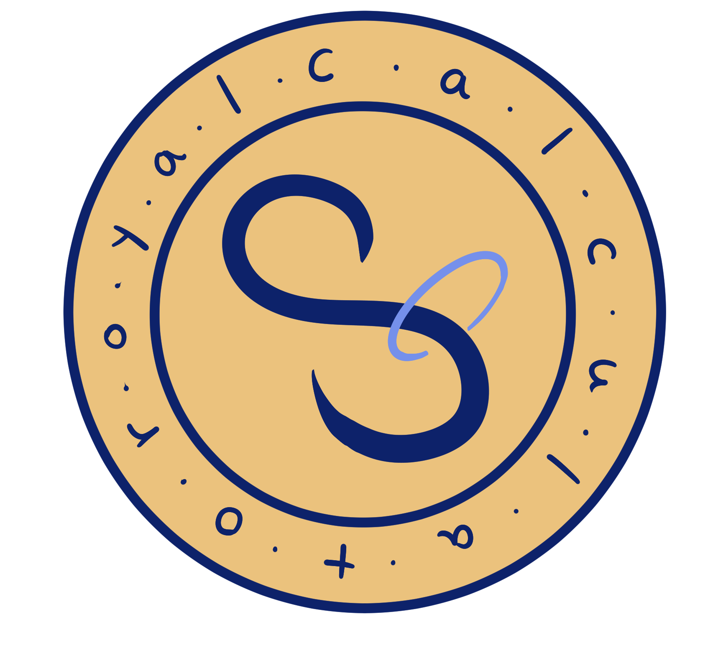

cal_math kingdom (케르메스 왕국)
- 수학이 세상의 중심인 세계관
- 국민들은 모두 계산기

 

  

케르원기

- 수(숫자/규칙)을 관장하는 아티팩트
- 악당 계산기가 훔쳐가서 수 체계를 어지럽힘

 

  

계산 기사단

- 왕국의 기사단

- 계산기 + 기사

 

스토리 발단
 
악당이 훔쳐감 블라블라어어어어

주인공 계산기는 프롤로그 스테이지에서 잃어버린 자신의 숫자 버튼들을 되찾고,
본 스테이지로 가서 악당 계산기와의 전쟁으로 숫자 뭉치들을 되찾아 세계를 회복해야 함 ( 숫자 뭉치들이 많을수록 세계 회복도 상승)

  

 

### 🔢 플레이 방식

📍튜토리얼

  
  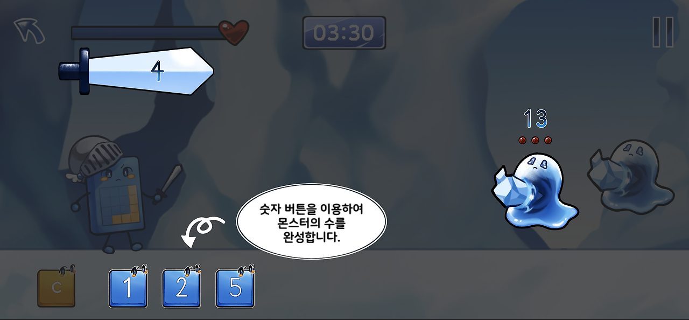
  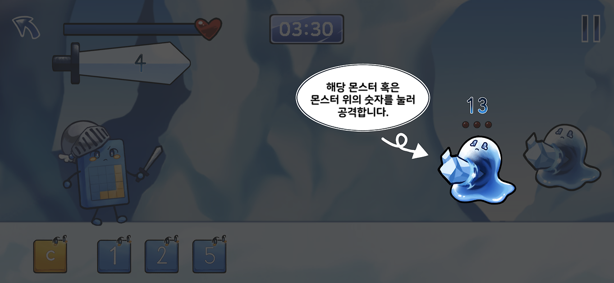
  
  
  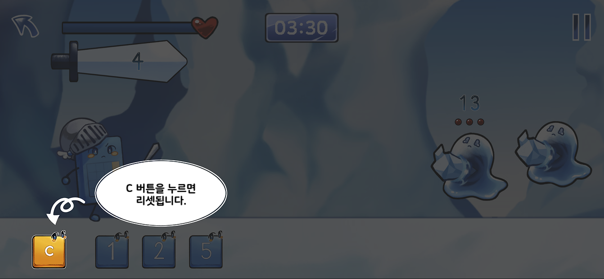
  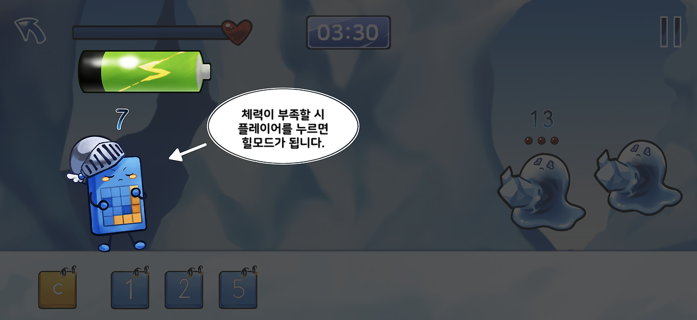
  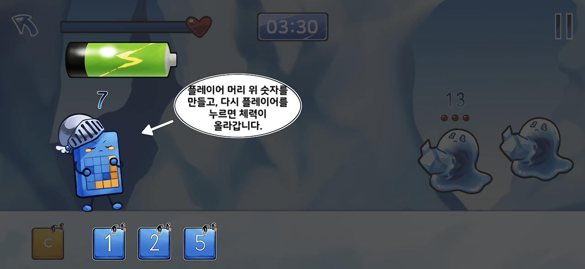
  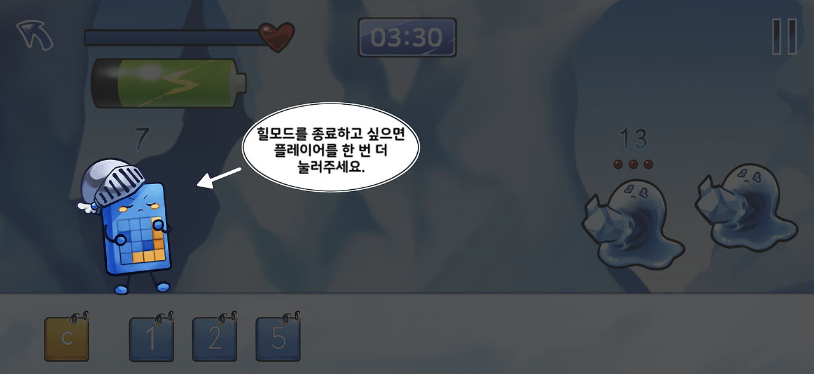
  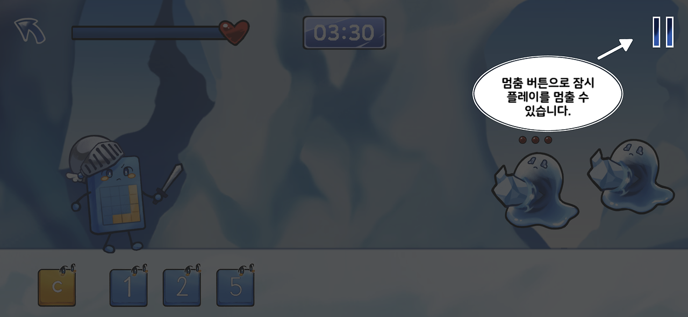
  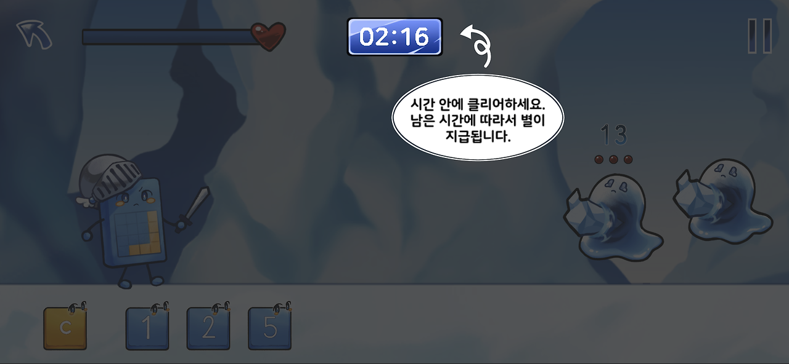

플레이 장면

  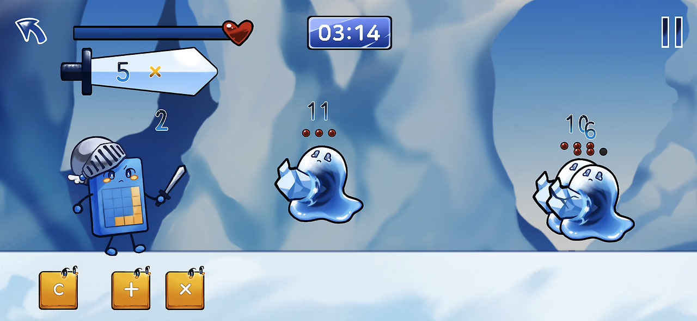
  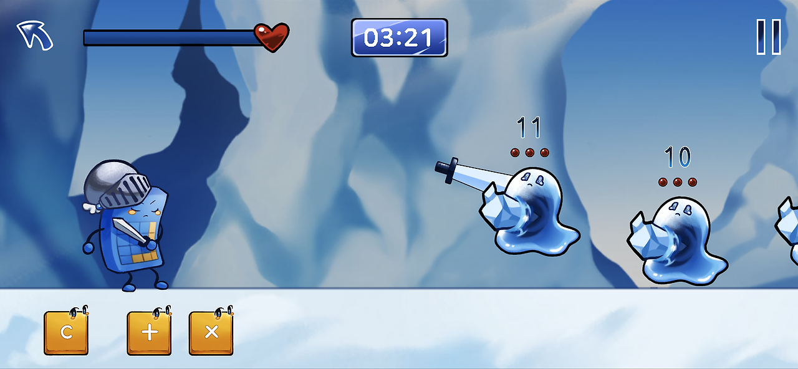

 
 
 

📍뺄셈나눗셈(숫자기본제공) 튜토리얼

  
  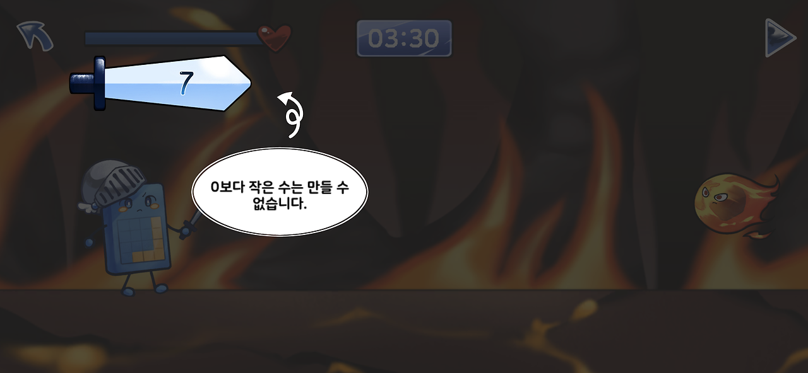
  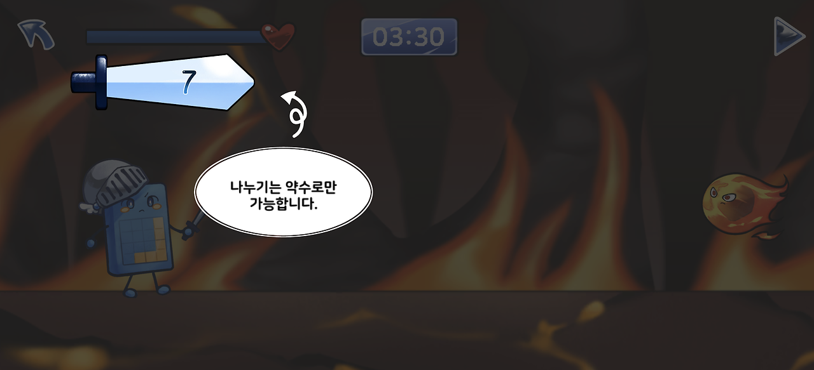

플레이 장면

  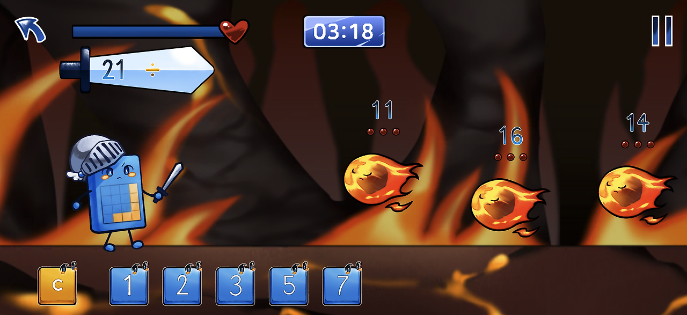

 
  
 
 
 
📍엔딩
 

  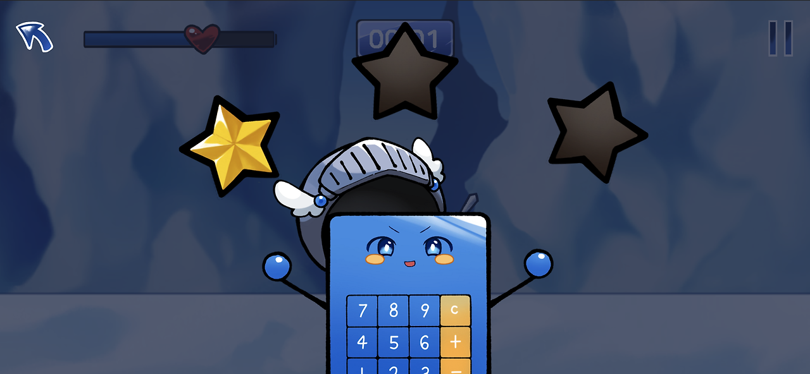

엔딩 1 : 성공 (별 3개)
 

  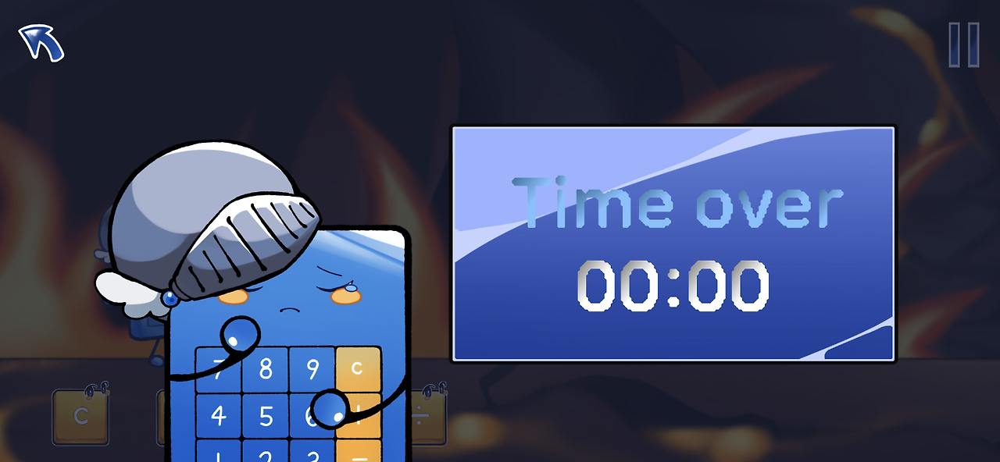

엔딩 2 : 실패 (타임아웃)
 

  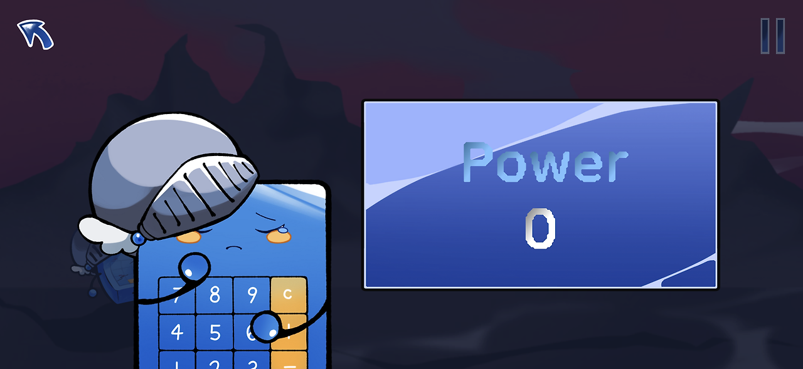

엔딩 3 : 실패 (체력 소진)

  
 
 

📍랭킹

  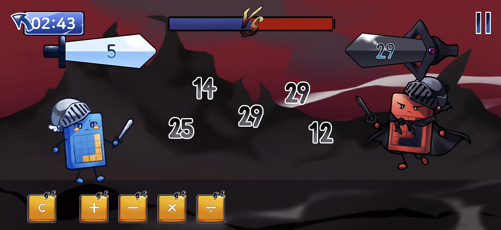

계산검술 연무장 (랭킹전)

 

### 🔢 계산 식

📍난이도

몬스터 속도와 수

- 조정 중...

시간

- 조정 중...

파워

- 조정 중...

 

📍보상제도

# 공사중...

  

계산기사 주인공의 숫자 버튼들 되찾기
프롤로그 챕터(바다)에서 이뤄짐
악당 계산기가 가져간 숫자들 중 자신의 숫자 버튼들을 스테이지 클리어를 통해 되찾음
얻은 숫자 버튼들을 다음 스테이지 전투에서 사용 가능
별
스테이지 클리어 시간에 따라 지급
3개 - 1개
숫자 뭉치
악당 계산기가 가져갔던 숫자들
스테이지 클리어 시 지급되는 별 개수에 따라 결정
세계회복도
악당 계산기가 가져갔던 숫자들(숫자 뭉치)를 많이 되찾아 올수록 세계 회복도가 증가
5단계로 구성
계산검술 숙련도
랭킹전에서 쌓을 수 있음
높은 직급으로 진급하기 위한 조건
다른 계산기사와의 대련을 통해 쌓는다는 컨셉 ( 보따리숫자 맞추기)
기사계급
검술 숙련도가 높은 순으로 랭킹이 매겨집니다.
케르메스 왕국의 기사단 내 계급입니다.
근위기사단장- 1명 /근위기사단원 - 10명 /기사단장 - 1명 /정규기사 - 20명 / 기사후보생 - 나머지
코인
화폐
아이템이나 새 캐릭터, 스킬을 얻을 수 있음
나무를 흔들어서도 얻을 수 있음
숫자 뭉치 구매도 가능
(과금템)
캐릭터 획득
얻은 코인을 통해 새로운 계산기사를 얻을 수 있음
📍미개발 기획 기능

- 마이룸 : 건물 배치

- 아이템 판매

- 스킬 획득

- 메인 스테이지 (악당과의 전투 : 숫자뭉치 획득 부분)

